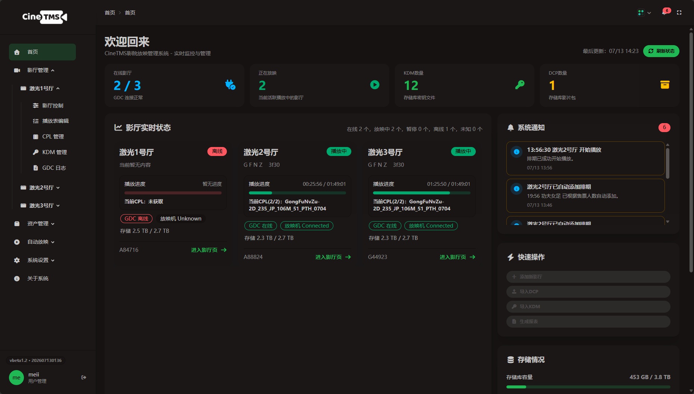
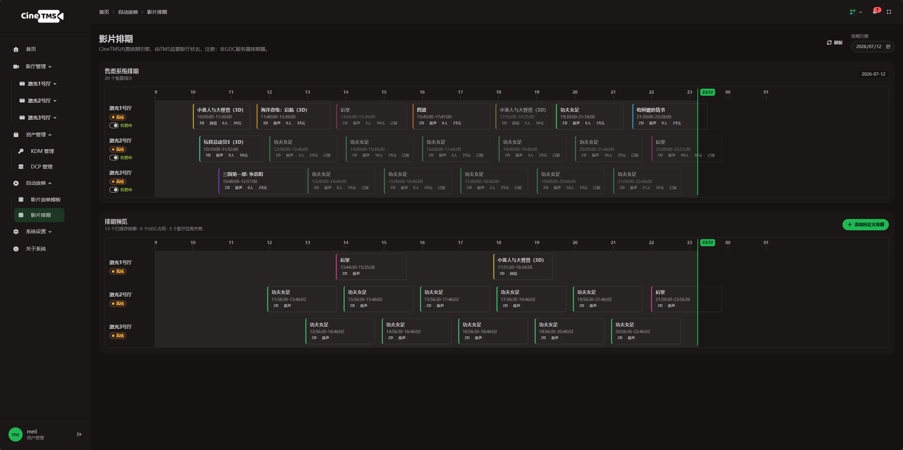

# CineTMS

CineTMS 是一个面向影院现场的自动化放映控制系统。它把售票排期、影厅设备、播放状态、影片包、CPL、KDM 和运行记录集中到同一个 Web 控制台中，帮助值班人员减少在多个系统之间来回切换，并在关键时间点自动完成放映准备和状态检查。

项目目前处于 **Beta 阶段**。由于个人精力和测试条件有限，当前仅适配以下组合：

- **售票系统：Finixx（凤凰佳影）**
- **放映服务器：GDC**

其他售票系统和放映设备暂未适配。欢迎基于现有模块进行二次开发、补充新的设备协议或提交改进。

> 本项目为个人开发项目，与GDC、Finixx等相关厂商不存在隶属或官方合作关系。实际部署前请确认设备接口、SDK 和网络访问符合厂商授权及影院内部安全规范。

## 界面预览

### 首页-影院运行总览



### 影片排期



## 主要能力

- **影厅集中控制**：查看 GDC 在线状态、播放状态、片单、CPL、KDM、设备日志和运行信息。
- **自动排程**：根据售票场次和放映模板创建排程，按时间准备加载、播放和状态检查。
- **内容存储库**：统一管理影片包和 KDM，并通过内置只读 FTP 向放映服务器提供内容。
- **通知与操作记录**：记录设备离线、导入失败、排期中断等异常，通过Server酱向外部设备发送通知。

## 工作流程

```text
售票场次
       ↓
同步影厅、影片和排期
       ↓
校验 DCP / CPL / KDM / 放映模板
       ↓
生成并监控自动放映任务
       ↓
播放准备和状态检查
       ↓
异常通知与操作记录
```

## 快速开始

### 准备条件

部署前请准备：

- 一台能够访问放映服务器网络的主机；
- 各影厅 GDC 放映服务器已连接到局域网，且主机可以访问；
- 一个可用的 **MySQL 数据库**，建议 MySQL 8（其它没试过），如果没有请自行安装；
- Node.js 22；
- npm（随 Node.js 安装）。


### 使用 Node.js 启动

```bash
git clone https://github.com/1105821037/CineTMS.git
cd CineTMS
npm ci
npm run build
npm run start:web
```

浏览器打开：

```text
http://localhost:4173
```

如需修改 Web 端口：

```powershell
$env:PORT = "8080"
npm run start:web
```

Linux/macOS：

```bash
PORT=8080 npm run start:web
```


## 项目结构

```text
src/
  modules/finixx/        Finixx 协议、签名和客户端
  modules/gdc/           GDC 连接、协议和 SDK
  runtime/               影厅运行时、状态轮询和指令调度
  server/                Web API、排程、资产、通知和数据存储
web/                     Web 控制台页面、样式和前端逻辑
scripts/
  kdm-auto-download-ts/  KDM 下载器
```

## 开发

安装依赖并构建：

```bash
npm ci
npm run build
```

启动编译后的服务：

```bash
npm run start:web
```

当前主要技术栈：

- Node.js + TypeScript
- 原生 HTML、JavaScript 与 Tailwind/DaisyUI
- MySQL

当前尚未承诺稳定的公共 API。进行二次开发时，建议将新的售票系统和放映设备实现放在独立模块中，通过现有服务层接入，避免在业务逻辑中直接耦合厂商协议。

## 注意事项

- 目前只在 Finixx + GDC 组合下进行开发和验证；
- 不同影院网络、GDC 软件版本和 Finixx 部署方式可能存在差异；
- 自动化控制涉及真实放映设备，正式启用前应在非营业时段充分测试；
- 项目仍处于 Beta 阶段，不建议未经验证直接用于关键生产流程。
- 欢迎二开！

## License

本项目采用 [Apache License 2.0](./LICENSE) 开源。
